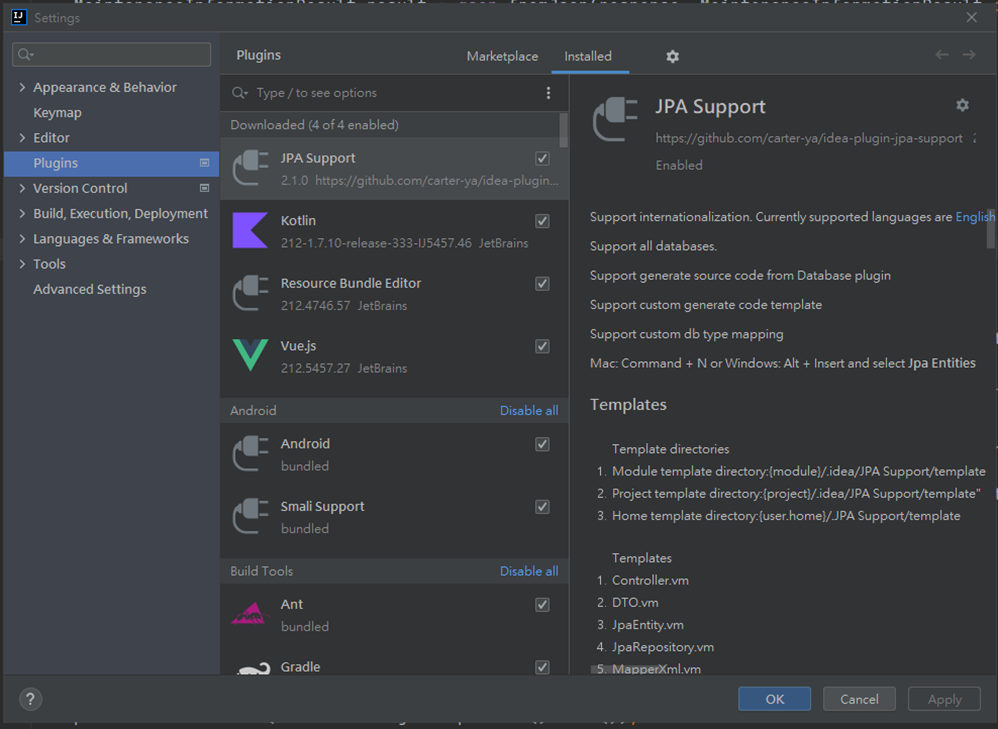

# JPA 工具操作

使用JPA最麻煩的就是要建置Repository跟Entity，如果表格欄位很多時，建立Entity要一個欄位一個欄位的輸入，這是非常冗長且無趣的工程，如果資料庫的表格又很多，那光是建置所需要的Entity可能就要耗費好幾天，如此費工費神的工作就必須交給工具處理，因此以下會介紹如何使用工具快速建立Repository跟Entity。

第一步：在Intellij中安裝JPA Support

<figure><figcaption></figcaption></figure>

第二步：下載所需要使用的資料庫連線Jar檔 ([MySQL](https://dev.mysql.com/downloads/connector/j/?os=26))

第三步：開啟工具並設定

<figure><figcaption></figcaption></figure>

<figure><figcaption></figcaption></figure>

第四步：設定參數，此工具最大的缺點就是很多參數必須手輸

* &#x20;Driver class：com.mysql.cj.jdbc.Driver
* Url：jdbc:mysql://localhost:3306/example
* Host：localhost
* Port：3306
* Database：example

第五步：設定完後，點選下一步就可以進入到class產製前的設定檔(請依據自身需求設定).png>)

第六步：最後勾選想要產製class的table名稱，點擊Start Generate就可以了

<figure><figcaption></figcaption></figure>
